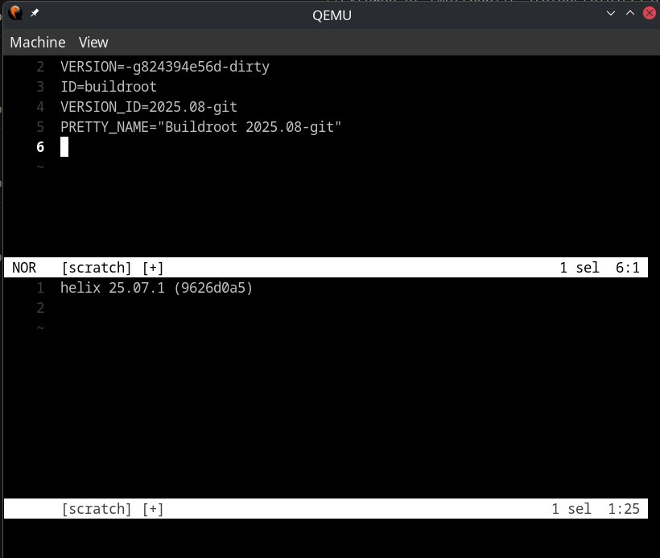
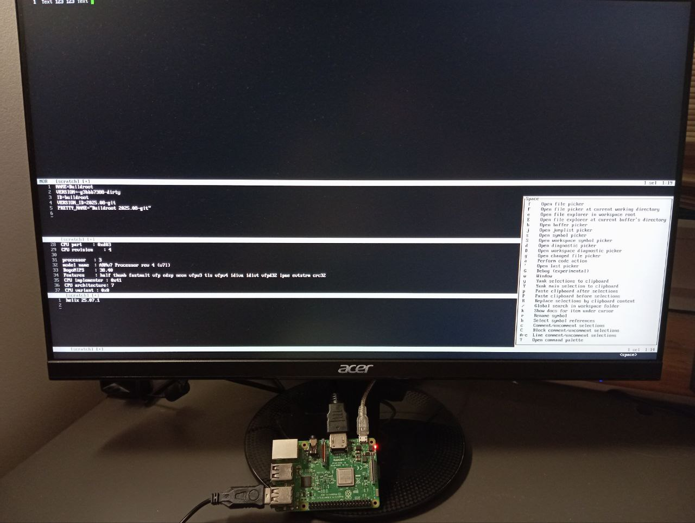

# About

A helper project to integrate [helix](https://github.com/helix-editor/helix) into
[Buildroot](https://buildroot.org/).

# Status

Helix works on the test platforms: Raspberry Pi 3 (ARM32), QEMU (AArch64), and
Orange Pi (AArch64). However, some issues were observed during the build and
runtime on the target devices.

**Rendering issues and crashes over the serial port**. While Helix works fine over
SSH or a display connected to a device, running it over serial lines leads to
crashes and rendering problems.

The issue is caused by Crossterm, which can return 0 for the number of columns
and rows. This happens because `tcgetwinsize` can report success but fill
the values with zeros. `Ok((0,0))` usually is unexpected for apps and not handled.

Here are related issues & PRs:
- [Crossterm](https://github.com/crossterm-rs/crossterm/pull/1007)
- [Helix crash](https://github.com/helix-editor/helix/pull/14050)
- [Helix render](https://github.com/helix-editor/helix/issues/14101)

Seems [AiChat](https://github.com/sigoden/aichat/pull/1366) has the same problem by the same reasons.

**Building grammars**. Now Helix is built with grammars disabled. There are still two common problems to solve: 

- The approaches conflict. Helix tries to pull and check grammars using `git`
during the build, while Buildroot expects all sources to be downloaded in
advance. No pulling or network operations should happen after that.

- Lack of configuration. While it's not critical to have an extra 100–200 MB
for hundreds of grammars on laptops with TBs of storage, this is not the case
for small devices. There, we usually need only 2-10 of the most common scripting
languages.

For now, it looks like both problems could be solved using `language.toml`.
But I haven't tested it much yet. Most likely, some other mismatches will be
discovered later.

# Examples

**QEMU aarch64**

**Raspberry PI3**

